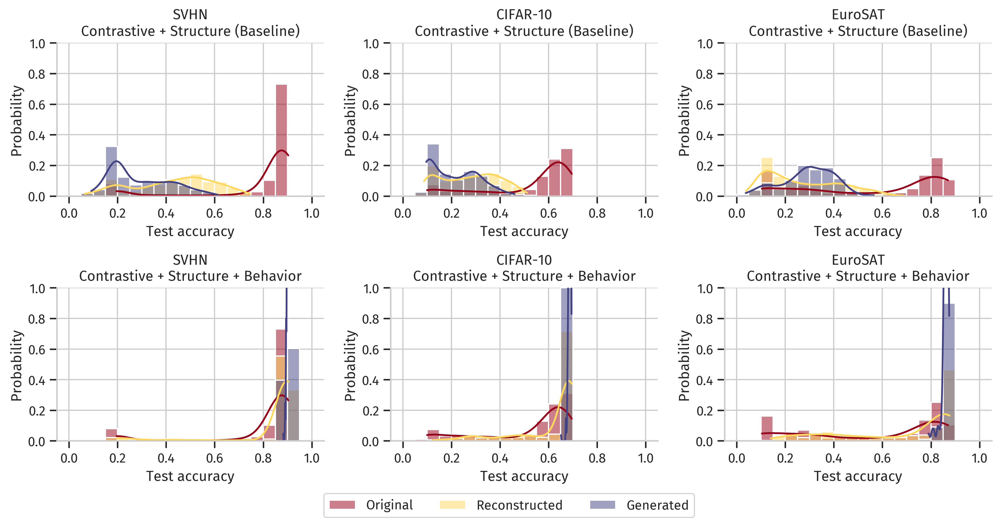

# Structure Is Not Enough: Leveraging Behavior for Neural Network Weight Reconstruction

<p align="center">

</p>

Code Repository for the paper: "**_Structure Is Not Enough: Leveraging Behavior for Neural Network Weight Reconstruction_**" at the ICLR 2025 Workshop on Neural Network Weights as a New Data Modality (WSL Workshop).

[](https://arxiv.org/abs/2503.17138)
[](https://doi.org/10.5281/zenodo.15051578)
[](https://openreview.net/forum?id=APsHrpqO3W)

## Abstract

The weights of neural networks (NNs) have recently gained prominence as a new data modality in machine learning, with applications ranging from accuracy and hyperparameter prediction to representation learning or weight generation. One approach to leverage NN weights involves training autoencoders (AEs), using contrastive and reconstruction losses. This allows such models to be applied to a wide variety of downstream tasks, and they demonstrate strong predictive performance and low reconstruction error. However, despite the low reconstruction error, these AEs reconstruct NN models with deteriorated performance compared to the original ones, limiting their usability with regard to model weight generation. 
In this paper, we identify a limitation of weight-space AEs, specifically highlighting that a *structural* loss, that uses the Euclidean distance between original and reconstructed weights, fails to capture some features critical for reconstructing high-performing models. We analyze the addition of a *behavioral* loss for training AEs in weight space, where we compare the output of the reconstructed model with that of the original one, given some common input. We show a strong synergy between structural and behavioral signals, leading to increased performance in all downstream tasks evaluated, in particular NN weights reconstruction and generation.

## Key Results

In this work, we demonstrate the importance of incorporating a **behavioral loss** alongside the traditional **structural loss** when training autoencoders (AEs) to reconstruct and generate neural network (NN) weights. While structural reconstruction (using mean-squared error, MSE) ensures that the reconstructed weights are close to the original, it fails to capture functional similarity, leading to reconstructed models with deteriorated performance. By introducing a behavioral loss that compares the outputs of the original and reconstructed models on a set of input queries, we achieve significantly improved performance in both reconstructive and generative downstream tasks. This is evident in the higher agreement between the original and reconstructed models, as well as the improved test accuracy of the generated models, which closely matches the performance of the best models in the original dataset.

Our experiments, conducted on three model zoos (SVHN, CIFAR-10, and EuroSAT), show that the combination of structural and behavioral losses outperforms the baseline (structural loss only) in all evaluated tasks. For instance, the reconstructed models achieve test accuracies comparable to the original models, and the generated models exhibit high performance without the need for further fine-tuning. Additionally, we find that the choice of input queries for the behavioral loss is crucial, as queries from a similar distribution to the training data yield the best results. This work highlights the synergy between structural and behavioral signals in weight-space learning and opens new avenues for generating high-performing NN weights efficiently.

<p align="center">
  

 
 <em>Figure: Evaluation of the reconstructive and generative downstream tasks, shown as distributions of the test accuracy of different models, depending on whether they are part of the original model zoo, reconstructions of models from that model zoo, or generated models. Each column represents one of our model zoos, while the row show what loss has been used to train the specific hyper-representation model.</em>

</p>

## Code structure

 - **scripts/**: Scripts used for training the model zoos and hyper-representation models
 - **skaling_hyper_reps/**: Code adapted from [SANE](https://github.com/HSG-AIML/SANE) \[1\] that includes our behavioral loss
 - **Notebooks** contain the code for the analysis of the results and the generation of the Figures

## Citation

If you use our work, please cite our paper:

```bibtex
@inproceedings{
  meynent2025structure,
  title={Structure Is Not Enough: Leveraging Behavior for Neural Network Weight Reconstruction},
  author={L{\'e}o Meynent and Ivan Melev and Konstantin Sch{\"u}rholt and Goeran Kauermann and Damian Borth},
  booktitle={ICLR Workshop on Neural Network Weights as a New Data Modality},
  year={2025},
  url={https://arxiv.org/abs/2503.17138}
}
```

## References

\[1\] Schürholt, Konstantin, Michael W. Mahoney, and Damian Borth. "Towards Scalable and Versatile Weight Space Learning." International Conference on Machine Learning. PMLR, 2024.
