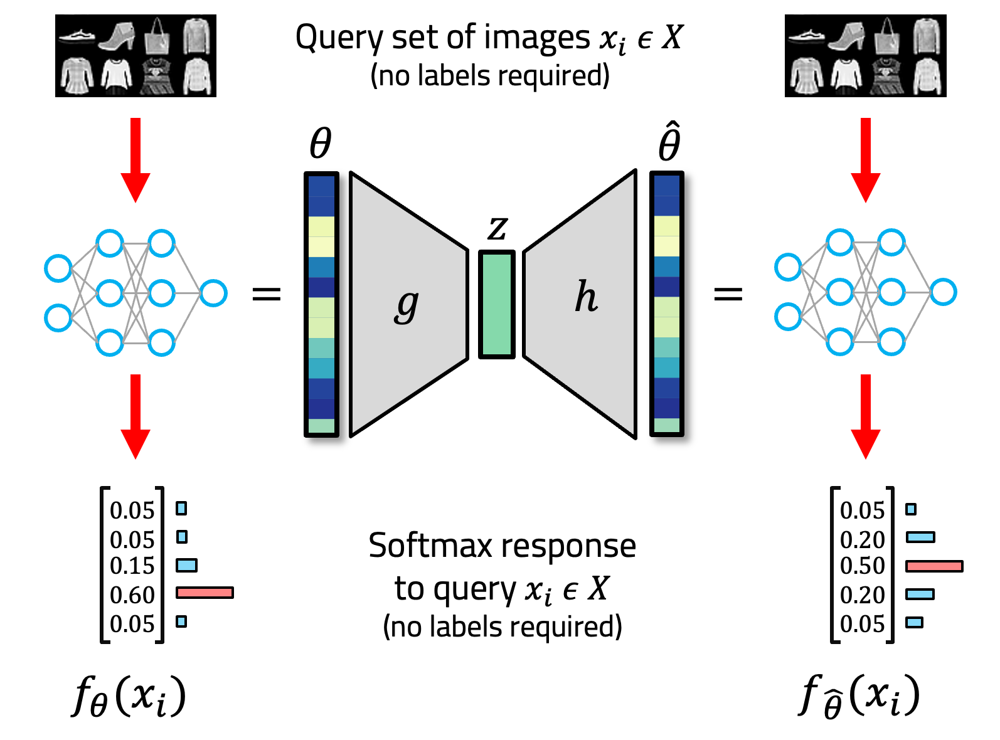

# Structure Is Not Enough: Leveraging Behavior for Neural Network Weight Reconstruction

<p align="center">

</p>

Code Repository for the paper: "**_Structure Is Not Enough: Leveraging Behavior for Neural Network Weight Reconstruction_**" at the ICLR 2025 Workshop on Neural Network Weights as a New Data Modality (WSL Workshop).

[](https://openreview.net/forum?id=APsHrpqO3W)

## Abstract

The weights of neural networks (NNs) have recently gained prominence as a new data modality in machine learning, with applications ranging from accuracy and hyperparameter prediction to representation learning or weight generation. One approach to leverage NN weights involves training autoencoders (AEs), using contrastive and reconstruction losses. This allows such models to be applied to a wide variety of downstream tasks, and they demonstrate strong predictive performance and low reconstruction error. However, despite the low reconstruction error, these AEs reconstruct NN models with deteriorated performance compared to the original ones, limiting their usability with regard to model weight generation. 
In this paper, we identify a limitation of weight-space AEs, specifically highlighting that a *structural* loss, that uses the Euclidean distance between original and reconstructed weights, fails to capture some features critical for reconstructing high-performing models. We analyze the addition of a *behavioral* loss for training AEs in weight space, where we compare the output of the reconstructed model with that of the original one, given some common input. We show a strong synergy between structural and behavioral signals, leading to increased performance in all downstream tasks evaluated, in particular NN weights reconstruction and generation.

## Code structure

 - **scripts/**: Scripts used for training the model zoos and hyper-representation models
 - **skaling_hyper_reps/**: Code adapted from [SANE](https://github.com/HSG-AIML/SANE) \[1\] that includes our behavioral loss
 - **Notebooks** contain the code for the analysis of the results and the generation of the Figures

## Citation

If you use our work, please cite our paper:

```bibtex
@inproceedings{
  meynent2025structure,
  title={Structure Is Not Enough: Leveraging Behavior for Neural Network Weight Reconstruction},
  author={L{\'e}o Meynent and Ivan Melev and Konstantin Sch{\"u}rholt and Goeran Kauermann and Damian Borth},
  booktitle={ICLR Workshop on Neural Network Weights as a New Data Modality},
  year={2025},
  url={https://openreview.net/forum?id=APsHrpqO3W}
}
```

## References

\[1\] Schürholt, Konstantin, Michael W. Mahoney, and Damian Borth. "Towards Scalable and Versatile Weight Space Learning." International Conference on Machine Learning. PMLR, 2024.
